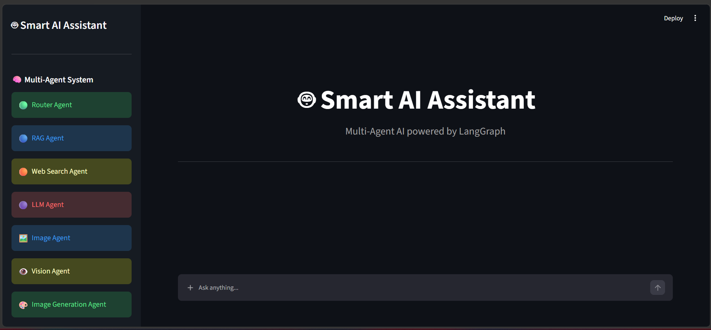

# Smart AI Assistant (LangGraph)

A **Multi-Agent AI Assistant** built using **LangGraph**, **LangChain**, **FAISS**, **Groq**, **Google Gemini**, **Tavily Search**, **SerpAPI**, **Pollinations.ai**, and **Streamlit**. The assistant intelligently routes user queries to specialized agents for company policy retrieval, web search, image search, image analysis, image generation, or general knowledge, providing accurate and context-aware responses.

---

## 📷 Application Screenshot



---

## 🖥️ Live Demo

[Open App](https://companypolicy-multiagent-langgraph-zj3fnpxozltx7mvfjfderr.streamlit.app/)

---

# Features

- Multi-Agent architecture using LangGraph
- Intelligent Router Agent for query classification, combining rule-based keyword matching with LLM-based fallback routing
- Retrieval-Augmented Generation (RAG) for company policy questions
- Web Search Agent using Tavily Search API
- Image Search Agent using SerpAPI, with duplicate detection (perceptual hashing), malformed URL filtering, and cross-turn "show me more" continuation
- Vision Agent for analyzing uploaded images (via Google Gemini 3.5 Flash), supporting multi-turn follow-up questions about the same image
- Image Generation Agent using Pollinations.ai, with automatic filtering of requests to generate real, named individuals
- LLM Agent for general knowledge and programming questions
- Query Rewriter for follow-up conversations, with context-aware resolution of references like "more", "another one", or "she/it"
- Conversation memory with chat history, persisted across turns via LangGraph checkpointing
- FAISS vector database for semantic document retrieval
- HuggingFace BAAI/bge-m3 embedding model
- Groq Llama-3.3-70b-Versatile for response generation
- Native chat input with built-in image attachment (no page-reflow issues)
- Real-time streaming graph execution, allowing UI state (like a pending image upload) to update the moment routing is decided, rather than waiting for the full response
- Displays retrieved context and source page numbers
- Response time measurement for every query
- Streamlit-based interactive user interface

---

# Tech Stack

- Python
- LangGraph
- LangChain
- FAISS
- HuggingFace Embeddings (BAAI/bge-m3)
- Groq (Llama-3.3-70b-Versatile)
- Google Gemini (gemini-3.5-flash) for image analysis
- Tavily Search API
- SerpAPI (Google Images)
- Pollinations.ai (free image generation)
- Streamlit

---

# Project Structure

```text
CompanyPolicy_MultiAgent_LangGraph/
│
├── agents/
│   ├── formatter_agent.py
│   ├── llm_agent.py
│   ├── rag_agent.py
│   ├── router_agent.py
│   ├── web_agent.py
│   ├── image_agent.py
│   ├── vision_agent.py
│   └── image_gen_agent.py
│
├── rag/
│   ├── data/
│   │   └── company_policy.pdf
│   ├── vector_store/
│   │   ├── index.faiss
│   │   └── index.pkl
│   ├── create_vector_db.py
│   └── retriever.py
│
├── tools/
│   ├── search.py
│   ├── serpapi_client.py
│   ├── image_gen.py
│   └── image_analysis.py
│
├── utils/
│   ├── chat_history.py
│   ├── conversation_utils.py
│   ├── helpers.py
│   ├── query_rewriter.py
│   └── image_request_parser.py
│
├── app.py
├── chatbot.py
├── graph.py
├── prompts.py
├── memory.py
├── state.py
├── styles.py
├── ui.py
├── requirements.txt
└── README.md
```

---

# How It Works

1. The user submits a question (optionally with an attached image) through the Streamlit interface.
2. Identity questions ("who are you", "tell me about yourself") are detected immediately, before any rewriting, so they can never be distorted by unrelated conversation history.
3. The Query Rewriter converts follow-up questions into standalone queries using recent conversation history.
4. The Router Agent determines the most suitable agent for the request, using rule-based keyword matching first, then falling back to an LLM classifier for ambiguous cases.
5. Depending on the query, it is routed to:
   - **RAG Agent** for company policy questions.
   - **Web Search Agent** for current or external information.
   - **Image Agent** for finding real photos on the web.
   - **Vision Agent** for analyzing an uploaded image (via Google Gemini 3.5 Flash).
   - **Image Generation Agent** for creating an AI-generated image.
   - **LLM Agent** for general knowledge, programming, AI, and reasoning tasks.
6. The selected agent generates a response.
7. The Formatter Agent prepares the final output and ensures all state fields are safely populated.
8. The application displays the answer along with response time, retrieved context, generated/found images, and source page numbers (when applicable).

---

# Multi-Agent Workflow

```text
                    User Query (+ optional image)
                              │
                              ▼
                     Identity Check (raw question)
                              │
                              ▼
                       Query Rewriter
                              │
                              ▼
                       Router Agent
                              │
      ┌───────────┬───────────┼───────────┬───────────┬───────────┐
      ▼           ▼           ▼           ▼           ▼           ▼
 RAG Agent   Web Search   Image Agent  Vision Agent  Image Gen   LLM Agent
      │           │           │           │           │           │
      └───────────┴───────────┴───────────┴───────────┴───────────┘
                              ▼
                       Formatter Agent
                              │
                              ▼
                        Streamlit UI
```

---

# Notable Engineering Details

- **Continuation tracking**: the router remembers which image agent (search vs. generation) was last used, so short follow-ups like "5 more" or "another one" correctly continue in the same mode instead of being misrouted.
- **Perceptual image deduplication**: image search results are hashed and compared using Hamming distance, filtering out near-duplicate images (not just exact URL matches).
- **Safety filtering**: the Image Generation Agent uses an LLM check to detect and block requests to generate images of real, named individuals, while still allowing fictional characters, objects, and scenes.
- **Streaming state updates**: the app uses `graph.stream()` rather than `graph.invoke()`, allowing the UI to react the instant the router decides a route (e.g., clearing an uploaded image immediately if it's not needed for the current turn) rather than waiting for the full agent response to complete.

---

# Future Improvements

- Named Entity Recognition (NER) for smarter routing
- Confidence-based routing
- Multi-document RAG support
- Voice-enabled interaction
- User authentication
- Database-backed chat history
- Batch image generation with reliable multi-image delivery
- Docker containerization
- Cloud deployment with CI/CD

---

## 👨‍💻 Author

**Harshit Ranjan**

A portfolio project demonstrating a production-style **Multi-Agent AI Assistant** built using **LangGraph** and **LangChain**.